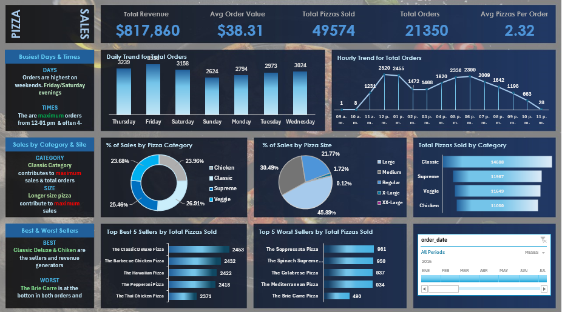

---

## 🛠️ Data Workflow & Technologies Used

1. **Data Storage & Modeling (MySQL):** 
   * Imported a raw database in `.csv` format containing over 48,000 records into a SQL environment.
   * Engineered optimized queries to extract precise insights answering key business questions.
2. **Data Connection & Extraction (Microsoft Excel):** 
   * Connected the processed SQL query results directly into Excel.
   * Utilized **Pivot Tables** to shape and structure the cleaned data.
3. **Data Visualization & Business Intelligence (Advanced Excel):**
   * Built an **Interactive Dashboard** using dynamic charts and slicers for executive decision-making.

---

## 🚀 Key Performance Indicators (KPIs)

* **Total Revenue:** $817,860
* **Avg Order Value:** $38.31
* **Total Pizzas Sold:** 49,574 units
* **Total Orders:** 21,350 orders

---

## 📊 The Final Dashboard (Visualization)

Below is the dynamic dashboard built for the client to filter operational and financial metrics by specific periods and product categories:

---

## 📈 Key Insights & Business Recommendations

* **Peak Days & Operating Hours:** Fridays and Saturdays during the evening witness the highest order volume. Critical rush hours occur between 12:00 PM – 1:00 PM and pick back up after 5:00 PM. *Recommendation: Scale up kitchen staff and delivery drivers during these peak timeframes.*
* **Consumer Preferences:** The **Classic** pizza category is the undisputed leader in both overall volume and total revenue generation, with the *Classic Deluxe* being the top-performing item.
* **Size Demand:** **Large** pizzas account for nearly **46%** of total sales, followed by Medium at 30%. *Recommendation: Optimize supply chain orders by prioritizing raw ingredients for large-sized doughs.*
* **Underperforming Products:** The *Brie Carre* pizza sits at the absolute bottom of sales volume and revenue generation. *Recommendation: Evaluate removing this item from the menu or running a targeted promotional bundle to clear inventory.*

---

## 📂 Repository Structure

* `data/`: Setup files for the underlying data.
* `sql/`: Native `.sql` files containing table schemas and analytical queries.
* `dashboard/`: The final interactive `.xlsx` workbook containing the layout.